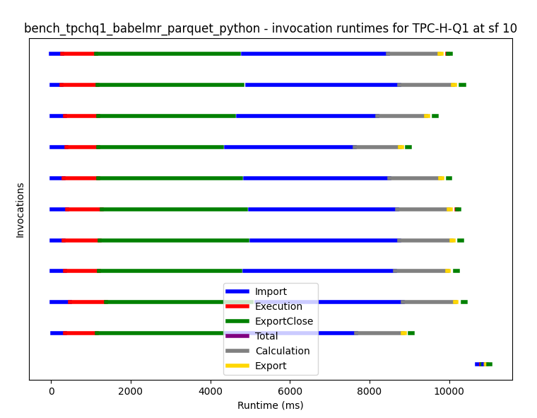

# BabelMR

BabelMR is a polyglot framework for Serverless MapReduce on AWS Lambda and S3.
This repository contains a first prototype like implementation of BabelMR and
allows users to benchmark it against PyWren, Corral and AWS EMR.

Right now the plan generation is still hardcoded, so only TPC-H Q1 and TPCx-BB-Q1
are supported.

## Setup

The BabelMR client is written in Python and requires some dependencies to run correctly. Run
```
pip install -r requirements.txt
```
to install them.

### Data
TODO

### User Code
To actually execute BabelMR, we first need to build and upload the user code. There are exemplary
implementations for TPCx-BB Q1 and TPC-H Q1 written in Python, C# and Go (for TPC-H) that can be
found in their corresponding folders with instructions on how to build them. Note that the Lambda
Functions should be configured with sufficient RAM, need access rights to S3, and most likely
require a timeout larger than 8 seconds.

### PyWren
As PyWren is no longer maintained, we had to do some minor bugfixes on PyWren itself. As the original
PyWren runtimes were no longer provided, we also had to handle building and uploading them ourselves.
Both repositories can be found in the submodules repository and contain basic introductions on how
to use them (setup by calling `git submodule update --init --recursive`).
## Execution

Set up your AWS credentials ([see boto3 documentation](https://boto3.amazonaws.com/v1/documentation/api/latest/guide/credentials.html)).
In addition, the AWS Account ID is also required (set environment variable `AWS_ACCOUNT_ID`).

To run queries cd into to the util folder. From there we first need to generate the plans by executing:

```
python generate_plans.py
```

After the plans are generated, we can invoke them using the `invoke.py` script. To execute TPC-H Q1
with the AWS Lambda function called `bench_tpchq1_babelmr_parquet_python` on scale factor `10`, we run:

```
python invoke.py --function bench_tpchq1_babelmr_parquet_python --mode babelmr --query tpc-h-q1 --format parquet --sf 10
```
The invoke output should then look something like this:

```
on 0: map Phase
|████████████████████████████████████████| 10/10 [100%] in 11.2s (0.48/s)
on 0: reduce Phase
|████████████████████████████████████████| 1/1 [100%] in 0.6s (1.66/s)

(Estimated) Price ($):  0.008432088
Duration:  11100
```
By default, a visualization of the executions should also pop up, which should look like this:



For further help and information on the available parameters execute:

```
python invoke.py --help
```